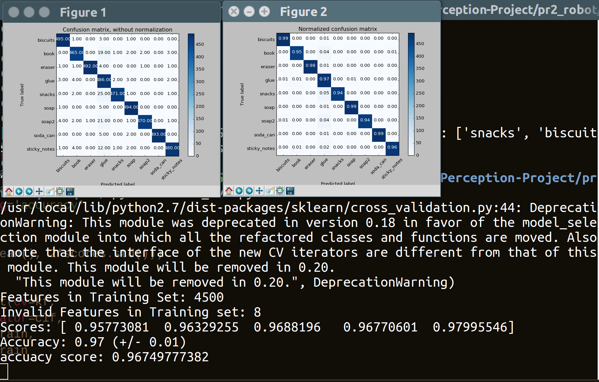
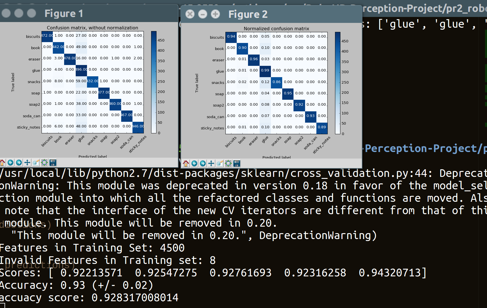
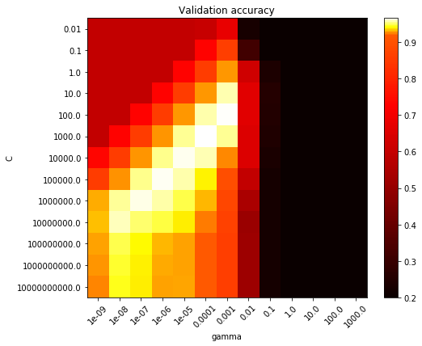
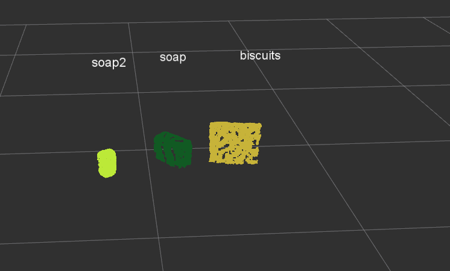
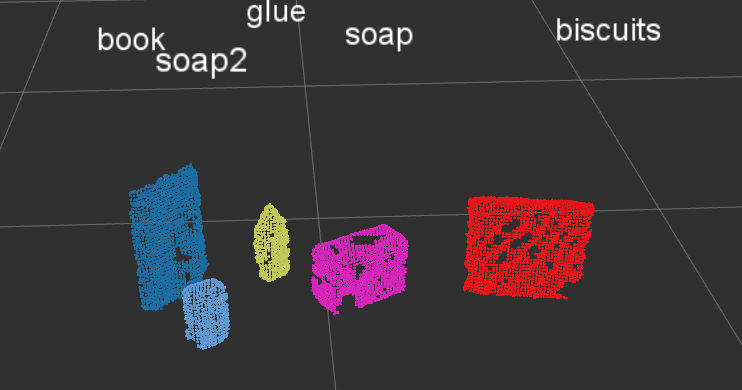
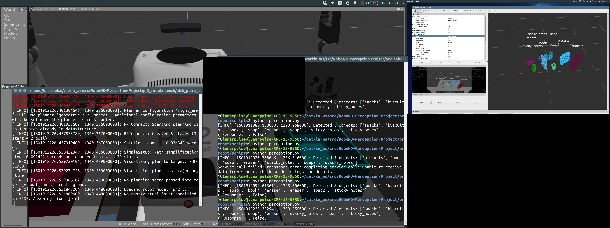
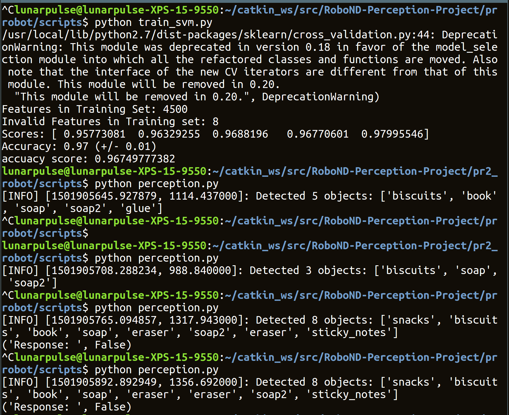

## Project: Perception Pick & Place
### Writeup Template: You can use this file as a template for your writeup if you want to submit it as a markdown file, but feel free to use some other method and submit a pdf if you prefer.

---

[image1]: ./images/indexSVM4500feats.png
[image2]: ./images/output1.png
[image3]: ./images/output2.png
[image4]: ./images/output3.png
[image5]: ./images/svmTrained.png
[image6]: ./images/terminalTest.png
[image7]: ./images/trainedSVMC1gamma1e_3.png
[image8]: ./images/terminalTest.png

# Required Steps for a Passing Submission:
1. Extract features and train an SVM model on new objects (see `pick_list_*.yaml` in `/pr2_robot/config/` for the list of models you'll be trying to identify).
2. Write a ROS node and subscribe to `/pr2/world/points` topic. This topic contains noisy point cloud data that you must work with.
3. Use filtering and RANSAC plane fitting to isolate the objects of interest from the rest of the scene.
4. Apply Euclidean clustering to create separate clusters for individual items.
5. Perform object recognition on these objects and assign them labels (markers in RViz).
6. Calculate the centroid (average in x, y and z) of the set of points belonging to that each object.
7. Create ROS messages containing the details of each object (name, pick_pose, etc.) and write these messages out to `.yaml` files, one for each of the 3 scenarios (`test1-3.world` in `/pr2_robot/worlds/`).  See the example `output.yaml` for details on what the output should look like.  
8. Submit a link to your GitHub repo for the project or the Python code for your perception pipeline and your output `.yaml` files (3 `.yaml` files, one for each test world).  You must have correctly identified 100% of objects from `pick_list_1.yaml` for `test1.world`, 80% of items from `pick_list_2.yaml` for `test2.world` and 75% of items from `pick_list_3.yaml` in `test3.world`.
9. Congratulations!  Your Done!

# Extra Challenges: Complete the Pick & Place
7. To create a collision map, publish a point cloud to the `/pr2/3d_map/points` topic and make sure you change the `point_cloud_topic` to `/pr2/3d_map/points` in `sensors.yaml` in the `/pr2_robot/config/` directory. This topic is read by Moveit!, which uses this point cloud input to generate a collision map, allowing the robot to plan its trajectory.  Keep in mind that later when you go to pick up an object, you must first remove it from this point cloud so it is removed from the collision map!
8. Rotate the robot to generate collision map of table sides. This can be accomplished by publishing joint angle value(in radians) to `/pr2/world_joint_controller/command`
9. Rotate the robot back to its original state.
10. Create a ROS Client for the `pick_place_routine` rosservice.  In the required steps above, you already created the messages you need to use this service. Checkout the [PickPlace.srv](https://github.com/udacity/RoboND-Perception-Project/tree/master/pr2_robot/srv) file to find out what arguments you must pass to this service.
11. If everything was done correctly, when you pass the appropriate messages to the `pick_place_routine` service, the selected arm will perform pick and place operation and display trajectory in the RViz window
12. Place all the objects from your pick list in their respective dropoff box and you have completed the challenge!
13. Looking for a bigger challenge?  Load up the `challenge.world` scenario and see if you can get your perception pipeline working there!

## [Rubric](https://review.udacity.com/#!/rubrics/1067/view) Points
### Here I will consider the rubric points individually and describe how I addressed each point in my implementation.  

---
### Writeup / README

#### 1. Provide a Writeup / README that includes all the rubric points and how you addressed each one.  You can submit your writeup as markdown or pdf.  

You're reading it!

### Exercise 1, 2 and 3 pipeline implemented
#### 1. Complete Exercise 1 steps. Pipeline for filtering and RANSAC plane fitting implemented.


Using the noise reduced data, voxel downsampling, Pass through, and RANSAC filtering was done sequentially. The table below shows the parameters used in the series of process.


|Process|parameter|value 1|value 2|
|--- | --- | --- | ---|---|
|Voxel downsampling|`LEAF_SIZE`|0.005| |
|Passthrough|`selected_regions`|-0.5 / 0.5| y|
|RANSAC|`max_distance`|0.00075| |

#### Outlier filtering

The inputs, point clouds, and registed images from the simulated RGB-D camera has much sensor noises, created by line 73 - 15 in [pr2_cloud_transformer.cpp](./pr2_robot/src/pr2_cloud_transformer.cpp). These noises are removed with statistical outliser filtering. With the mean k value of 10, the filtered output was resemble to the original image before the noise addition.

#### Voxel downsampling

The `LEAF_SIZE` was chosen to be the smallest possible value to get the highest matching rate with the trained SVM model because the trained model was not downsampled before the creation of the histogram. From experiments with this variable, 0.005 was selected and provides highest accuracy in object recognition. Indeed, there is no downsampling 0.005 is being used in the cpp src, as this step was requested to use in the rubric.

#### Passthrough filtering

Pass through filter removes unwanted artifacts such as the sides or the dropbox bins. These dropbox bins erratically recognised as glues or other contents as the svm must return a recognised result based on the model and cannot be uncertain although the the picture of the test sample is not complete. Pass through flter was to narrow the processing area to reduce the forced erroneous recognition. I tried to figure out that svm prediction withthraw the recognition if the svm model shows low probablility of recognition result. This was not supported by `sklearn` library.

#### RANSAC segregation

Finally RANSAC parameter `max_distance` was chosen to be 0.00075 from multiple parameter choice experiments.  The RANSAC filter divides scene to table and others, objects on the table.

#### 2. Complete Exercise 2 steps: Pipeline including clustering for segmentation implemented.  

The Eucledean Clusterting required more fine tune and dependant to the previous filtering parameters.

 No. | Parameter | Value |
 --- | --- | --- | ---
 1 | `Tolerance` | 0.005 |
 2 | `MinClusterSize` | 80 |
 3 | `MinClusterSize` | 2500 |

The table above show the chosen values per parameter which clusters each object well. With other parameters, Tolerance parameter was sensitive from 0.005 to 0.010. A parameter lower than 0.005 included the front side of the table as an object and more than 0.010 falsely recognised objects, segregating more or less than the actual number of the objects.

The mininum and maximum cluster size acts like a filter to determine the size of an object possible to recognise as a single entity. Mininum was matched to part of glue in test3 world and other the maximum was chosen to include all the entities possible to be seen in the scene. In fact, this upper limit can be tuned to ignore the part of frone side of the table and dropbox bins entities.

#### 3. Complete Exercise 3 Steps.  Features extracted and SVM trained.  Object recognition implemented.

SVM model was trained with the dataset extracted in a similar way as the lessons shown and the script was modified to suit this project. [capture_features.py](./pr2_robot/scripts/capture_features.py) contains the procedures to capture training sets including all the objects available for this projects. The number of feature sets collected was 4500 and this was required to form a stable prediction with accuracy.

Training this model took more than 5 hours. The result of the prediction is shown in the figure below. The C and gamma value for the image below is:
```python

clf = svm.SVC(C=1000.0, cache_size=200, class_weight=None, coef0=0.0,
    decision_function_shape=None, degree=3, gamma=1e-04, kernel='rbf',
    max_iter=-1, probability=False, random_state=None, shrinking=True,
    tol=0.001, verbose=False)
```





The image above shows lower accuracy due to the different C and gamma value. Instead of manually finding the local maxima for accuracy for two significant vairables, C and gamma, grid search was used to perform a systematicall analysis with visualisation of results in a grid map. The image below shows the result of the grid search for two variables. The jupyter notebook contains this experiment is [trainSVM.ipynb](./pr2_robot/scripts/trainSVM.ipynb)



The brightest colour in the graph shows the hightest accuracy. In this featuresets, C = 100 and gamma 0.001 was the best parameters for accuracy. Even though the SVM models provides 97 percent of prediction accuracy, SVM has an intrinsic flaws in object recognition. In a cluttered environment, partial sample scene of an individual object can be falsely recognised as other objects. In addition, our histogram based feature sets only provides normalised histogram data of the each scene, this results in fasle prediction of other objects which contains similar sets of historam from the projection in some angles and also partial view of an object. In fact, some false prediction of other objects as glues are shown in the pictures above and this happens more frequently in the recognition tasks in Rviz.

[train_svm.py](./pr2_robot/scripts/train_svm.py) contains codes based on the grid search.

[perception.py](./pr2_robot/scripts/perception.py) is the main script for this project, object recognition. This file was implemented in accordance to the comment sequentially with slight modification.

### Pick and Place Setup

#### 1. For all three tabletop setups (`test*.world`), perform object recognition, then read in respective pick list (`pick_list_*.yaml`). Next construct the messages that would comprise a valid `PickPlace` request output them to `.yaml` format.


#### Recognition status

The figures below shows the screenshots in Rviz.







The clusted image with labels show neatly clusted voxels with correct lables. The last picture shows the entire workspace for this project too and the figure below shows the termimal outputs.



The test world are recognised by class function `scene_check`, line 38 to 52, of class `perceptionState` and loggin was used to debugg, however, codes in call back function was not tracked. In addition, rotated state was flagged during prior to object detection.

In pick and place tasks, world test1 and test2 correctly perform pick and place according to the list files. But, testworld test3 requires appropriate collision avoidance using Moveit. The orientation and w value for pick_pose and place_pose were initialised to 0 and it gets warnings but still Moveit performs place. I am still considering what numbers should be inserted for these values.

The recognition performance and yaml files for the test worlds are:

|world|accuracy|yaml file|
|---|---|---|
|test1|100%|[output1.yaml](./pr2_robot/scripts/outputs/output1.yaml)|
|test2|100%|[output2.yaml](./pr2_robot/scripts/outputs/output2.yaml)|
|test3|87.5%|[output3.yaml](./pr2_robot/scripts/outputs/output3.yaml)|

As long as the entire view of the scene was sent as input after clustering, the recognition was successful. The reason why the part of glue behind other object in test3 was not successful is that the trained SVM does not contain the exactly matching histograms for colour and normals for the partial arfifact. This is a main drawback for this sampling and training method, which ignores the geometric and colour features of the objects and easily gets confused with the incomplete similar ones.

The tasks of extra challenges are on the way with this project. Not included all in this commit.
#### More thoughts

As a couteract for this inaccuracy, I am expeimenting convolutional neural network to substitute the SVM models. CNN can compare the each geometry features and hardly  be confused with other features. However, the creation of dataset is hard part and also the training this model is even harder and time consuming part.

The data set for CNN requires the angles of the object in quaterinion in addition to the current sets and this will be used to set the angle parameters durng the training. Training CNN for 3D model is non-trival and rarely done so far. My idea to train 3D model is to train the model in relation to use angles of an object. This forms multiple models of 2D convolutional neural networks combined in a discreet number of angles. This continuity of angles can be used but this will increase the state space to the infinity. However, discreet angles can make gaps between the prediction. Finally, this method always perform all possible angles per a prediction unless knowing the angle from other factors, such as counting or normals of the obect. So far it has been experimented and has not been successfully implemented in this project with submission. However, the optimal training of the CNN will be sought after posterior to the submission.

### Conclusion
All in all, this project introduced me many aspects of perception tasks and deepened my thoughts about this field more. Thanks for your reading time.
